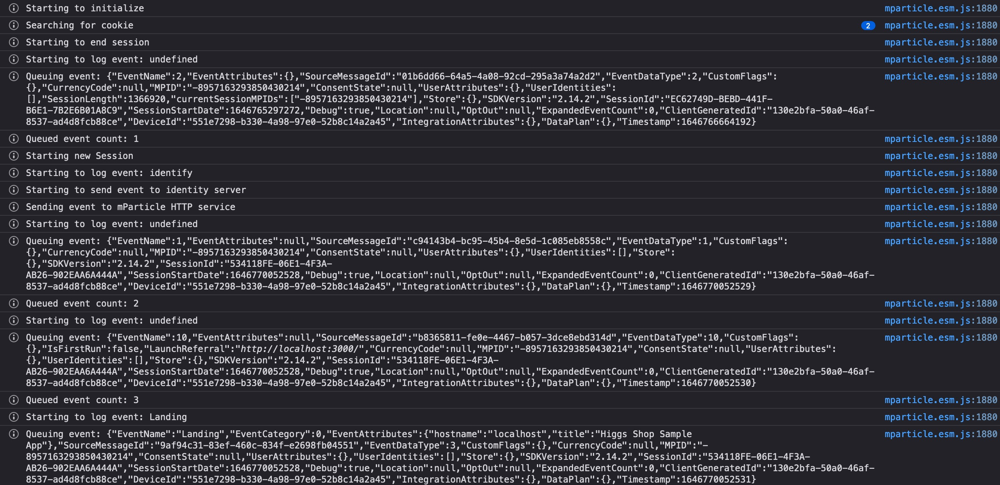
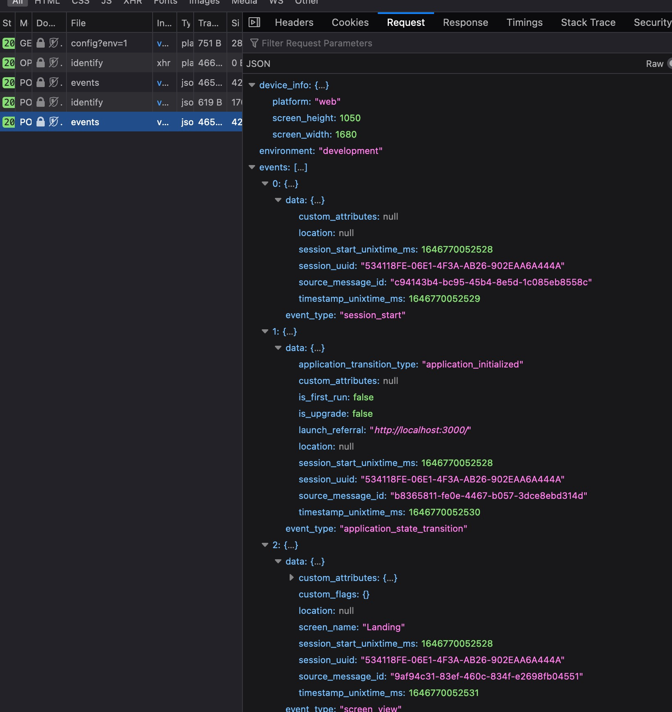

<br>


# The Higgs Shop Sample App

The Higgs Shop is an example app that implements the mParticle Web SDK to highlight the features and implementation details of mParticle for Web Apps.

The purpose of the app is to highlight the following features:

-   Creating an instance of the mParticle Web SDK
-   Setting up an optimal mParticle configuration with debugging enabled
-   Sending Events and Custom Attributes to mParticle

## Getting Started

1. Open the root of this project in your IDE or Editor of choice

2. Install package dependencies using `npm install`

3. In the root of the project, rename `.env.sample` to `.env` and update the `REACT_APP_MPARTICLE_API_KEY` environment variable with with your mParticle Web API Key

-   Visit your [mParticle Workspace](https://app.mparticle.com/setup/inputs/apps) to generate API Credentials

4. Run the projet using `npm start`

This will spawn a development server and open your browser to the Higgs Shop Sample App

### API Credentials

**NOTE** These Sample Apps require a mParticle account with an API key and Secret.

While the code might run and build without mParticle credentials, the SDKs will not upload events to our servers and will generate errors.

Please visit https://docs.mparticle.com/ for more details on setting up an API Key.

## Events used in this app

To make things simple yet declarative, this application has been built in such a way to keep event tracking close to the components that might logically trigger them rather than a fully DRY implementation. We've opted to be more repetitive so examples are consise and documented as necessary.

Please feel free to also visit our [Doc Site](https://docs.mparticle.com/) to gain more familiarity with some of the more advanced features of mParticle.

### Page Views

In cases where it is necessary to track visitors as they navigate your Web Application, mParticle offers [Page View Tracking](https://docs.mparticle.com/developers/sdk/web/screen-tracking/).

In this Sample App, page views are triggered via React's `useEffect` hook within all the **Page** Layout Components. Each lives within `src/pages` and fires a single _Page View_ when the component is rendered.

For example

```typescript
useEffect(() => {
    // Renders an initial cart view when the page loads
    mParticle.logPageView('View My Cart', {
        number_of_products: numberOfProducts,
        total_product_amounts: subTotal,
    });
}, []);
```

In some cases, we fire a _Commerce Event_ instead of a _Page View_ to track more e-Commerce related attributes.

### Custom Events

Most often, you will need to use [Custom Events](https://docs.mparticle.com/developers/sdk/web/event-tracking/#custom-events) to track events in a way that is unique to your use case. mParticle provides types of _Custom Events_ ranging from Navigation Events to Social Media Engagement and are mostly used to organize your data in a way that makes sense to you.

Many of our components in `/src/components` make use of these events, particularly the `NavigationMenuItem` Component.

```typescript
mParticle.logEvent(
    'Navbar Click',
    mParticle.EventType.Navigation,
    customAttributes,
);
```

### Commerce Events

This Sample App emulates a simple e-Commerce application and makes heavy use of mParticle's [Commerce Events](https://docs.mparticle.com/developers/sdk/web/commerce-tracking/).

Some events used in this application:

-   Add To Cart
-   Remove From Cart
-   Product Detail
-   Product Impression
-   Checkout
-   Purchase

Most _Commerce Events_ follow a similar pattern, requiring that you first generate an **mParticle Product** Object, which then gets passed into the `logProductAction` method.

You should map your own product attributes to be consistent with your [Data Plan](https://docs.mparticle.com/guides/data-master/introduction/) if you are leveraging that feature. Using Data Plans ensures data consistency within an app and across devices.

```typescript
const { label, id, price, color, size } = product;

const mParticleProduct: mParticle.Product = mParticle.eCommerce.createProduct(
    label,
    sku,
    price,
    quantity,
);

mParticle.eCommerce.logProductAction(
    mParticle.ProductActionType.AddToCart,
    mParticleProduct,
);
```

Most Commerce Events are used within the following components:

-   `/src/pages/ProductPage.tsx`
-   `/src/pages/CartPage.tsx`
-   `/src/features/OrderDetails/OrderDetailsCartView`
-   `/src/features/OrderDetails/OrderDetailsPurchaseReview`

## Discovering Events

As a developer, sometimes the best way to learn is to just dig into the code or your debugging tools. To that end, this sample app ships with a verbose logger that you can view details of what our SDK is doing within your browser's console.

### Browser Console





### Live Stream

To verify that your events have arrived at mParticle's servers, or to compare your Web Events from that of our other SDKs, you can also visit our [Live Stream](https://docs.mparticle.com/guides/platform-guide/live-stream/).

This will not only show your data as it enters mParticle, but also as your data is forwarded to our various partner services and integrations (if enabled).

## Development Notes

This project was bootstrapped with [Create React App](https://github.com/facebook/create-react-app).

You can learn more in the [Create React App documentation](https://facebook.github.io/create-react-app/docs/getting-started).

To learn React, check out the [React documentation](https://reactjs.org/).

## Support

<support@mparticle.com>

## License

The mParticle Web SDK is available under the [Apache License, Version 2.0](http://www.apache.org/licenses/LICENSE-2.0). See the LICENSE file for more info.
